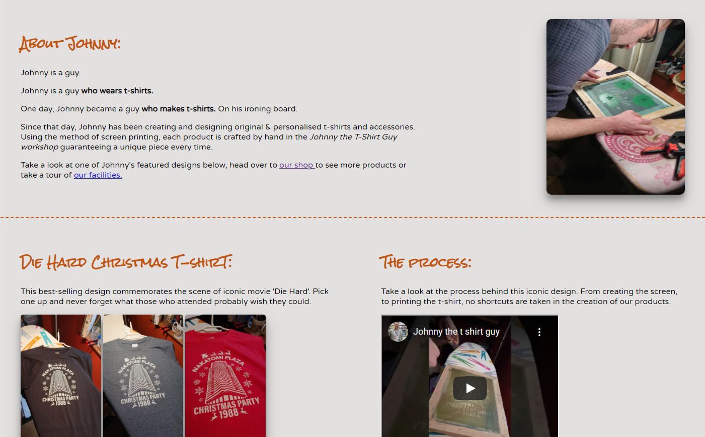

# Johnny the T-Shirt Guy

[Link to live site.](https://sammartin92.github.io/hello-project/)

## Objective
My objective in this project is to build and deploy a static front end application for my first milestone project for the Code Institute using HTML & CSS. The 'client' in for the purpose of this project is my brother-in-law Johnny who designs and prints t-shirts & accessories. 

The Johnny The T-Shirt Guy website is an online store for the small business Johnny the T-Shirt Guy. It is a simple site which allows users to gain awareness of the business, view and order products & make enquiries with Johnny. I have laid out the user experience design below:

## Strategy:<ul>
<li>Build an e e-commerce site to promote the Johnny the T-Shirt Guy business and sell products.</li>
<li>Showcase the products, ethos & capablilites of the business to users.</li>
<li>Provide point of contact for users to generate business & grow customer base.</li>
</ul>

## Scope: <ul>
<li>Build a simple static website with a landing page including a blurb on Johnny The T-Shirt Guy describing the purpose of the site to users.</li>
<li>Provide a store page to advertise existing designs and previous personalised works.</li>
<li>Allow users to easily make orders and submit requests to the business.</li>
</ul>

## Structure: <ul>
<li>Build a simple site with linear design including a Home Page, Store page and Orders page.</li>
<li>Include a consistent navigation bar on each page</li>
<li>Include anchor tags in text of Home and Store pages to encourage users to navigate to order form</li>
</ul>

## Skeleton: <ul>
<li>Simple static layout to  clearly display text & product images</li>
<li>Before beginning, I built the basic structure of the project in a <a href="https://www.github.com/SamMartin92/practice-for-first-project">practice repository</a> </li>
<li>I then spoke with my mentor and agreed how the three pages of the site would be laid out</li>
</ul>

## Surface: <ul>
<li>Consistent hero image of 'workshop' across each page to portray the DIY, homemade, indepandant feel of the business</ul>
<li>Simple us of an off-white backgorund and a rustic orange for text and symbols</li>
<li>Reliant on media (images and video) minimal use of borders to maintain a simple layout</li>
</ul>

# Features:

## Existing features:

**Header:**

<ul>
<li>The header is consistent on all three pages. It contains the home-image button on the left and navigation menu to the far right. It allows users to navigate easily to and from each page the site. </li>
<li>The home-image is a button which directs the user to index.html. It is a stylisic choice as it serves the same purpose as the Home element in the navigation menu. I chose to add this to portray a logo for the site. It is taken from a photo of a handwritten signature from Johnny with the background removed.</li>
</ul>

**Hero Image**

<ul>
<li>The hero image displays across all pages for screens with a width greater than 700px. It shows the 'workshop' in which the products are made and the aim is to give the site a charming, homely feel. There is a painted logo in the center of the photograph with the name of the business. </li>
<li>There is a heading block over the hero image on the home page and store page and an order form on the orders page. From reading the heading blocks, it is immediately apparent the pirpose of the site and what is being sold.</li>
<li>There is a few second delay on the display of the hero image to add a bit of penache to the appearance of the site. ON smaller screens, the home image is not displayed and instead just the content of the heading block.</li>
</ul>

**Home Page**

<ul>
<li>The home page contains a small blurb about the company, a featured design and an embedded video shwoing the process of making the featured t-shirts.</li>
<li>This is simple and done with a bit of humour. The user will get a feel for the business and will be displayed with one of the more popular designs once they scroll by the hero image</li>
</ul>

**Footer**

<ul>
<li>The footer is extremely simple. It contains one top-border to seperate it from the main page and two links to the company's social media sites.</li>
<li>This allows users to redirect and follow the business on facebook or instagram</li>
</ul>

**Shop Page**

<ul>
<li>The shop page displays the existing designs available for purchase. The images cards have a small shadow behind them to appear as if they are projecting slightly from the screen with a two-line tag line below each.</li>
<li>The images are repsonsive and will justify across the screen depending on the width.</li>
</ul>

**Gallery**

<ul>
<li>Just below the products on the shop page is the gallery of previous personalised orders displayed in columns depending on the screen width.</li>
<li>There is a link to the Orders Page just above and the variety of images is thee to sell the user on making personalised orders for a range of different items.</li>
<li> The idea and code for the gallery came from the Love Running Project Essentials Prject with the Code Institute</li>
</ul>

**Order Form**

<ul>
<li>The order form is presented as to allow users to purchase a product or make an enquiry. The name and email fields are the only mandatory fields to ensure contact can be made with the user who submits the form if necessary.</li>
<li>It includes dropdown list of sizes and all products currently displayed on the shop page.</li>
<li>The heading 'Buy Our T-shirts' communicates the purpose of the form and does so in a humourous and informal way in keeping with the feel of the site and company.</li>
<li>Please note, this form does not yet function and is merely a dummy for the purpose of this project.</li>
</ul>

## Features left to implement

There are some features which I would like to implement on this site once I have progressed through this course and further developed my coding skills:
<ul>
<li>I would like to implement a real order form with e-commerce capablilities to allow users to actually make a purchase directly from the site.</li>
<li>In the shop page, I would like to have an interactive side scrolling bar which displays the products and allows users to through by clicking an arrow to the left or right on desktop, or by swiping on a tablet or mobile.</li>
</ul>

**Font & Colour scheme**
<ul>
<li>I chose Rock Salt as the font for headings across the site. I wanted to choose a handwritten font to align with the DIY, homemade image the business portrays. It also matches well with the home-image button which is an actual written signature.</li>
<li>For the paragraph font, I chose Varela Round. This font is clear but does not seem overly formal, which contributes to the image the business would like to portray.</li>
<li>Fonts were found & imported from Google Fonts.</li>
<li> For the heading text, borders, header & footer and some text in index.html, #c45508 was chosen. </li>

<ul>
<li>This is a rustic burnt orange colour which brings Autumn to mind. This is in keeping with the predominatly orange colour of the hero image.</li></ul>
<li>As a general background for the site, #e2e1e0 was chosen. </li>

<ul>
 <li>This is an off-white colour which contrasts well with the burnt orange & black text on the site. The off-white tone does so with a warmer feel than pure white.</li>
</ul></ul>

# Testing
<ul>
<li>This site was built using just html & css. As such, the main testing requirements came in ensuring the site was responsive on all screen sizes.</li>
<ul><li> The majority of testing in this regard was done in dev tools while building the webiste. This was done by selecting different device types from the dimensions list and by altering the wilih of the site and checking for errors</li> </ul>
<li>I tested the site in edge, chrome, & firefox to ensure it was functional across the most prominent browsers and tested the site on mobile to ensure the it acted as it did in dev tools.</li>
<li>I used lighthouse to generate reports for mobile and desktop. My main concern for this project was the accessability </li>
<ul><li>As it scored over 90 I am satissfied with the result. In future projects, I will aim to raise the rating of the performance & best practices for mobile. Results shown below:
</li>
</ul>

<li>Each page on the site was passed through the html vaidator https://validator.w3.org/ to ensure there were no errors.

</li>
<li>Similarly, style.css was passed through https://jigsaw.w3.org/css-validator/ to ensure there were no errors.

</li>
<li>The form on the Orders page was tested to ensure it was set up correctly and all data submitted was recieved accurately. As this is a dummy form, the value for action used was https://formdump.codeinstitute.net/. </li>
<ul><li>This is the dummy page used in the Coders Coffeehouse walkthrough project in the HTML & CSS Essentials modules and served the same purpose for validating the form element of my project.</li></ul>
<li>All anchor tags were tested to ensure they worked and to ensure external links opened in seperate tabs.</li>
</ul>

## Bugs

<ul>
<li>The 'The Process' video which I uploaded, originally as an mp4 did not function as I had wished. Using the controls attribute, the video could be played & paused and made fullscreen, however, the user could not seek through the video and skip forward and backwards. I tried to understand why but remained unsure, the size of the file may have been a factor.</li>
<ul><li>The fix for this was not a purely coding fix. Instead, I uploaded the video to youtube and embedded it in the html as an iframe element. </li></ul>
<li>The hero image resposiveness presented me with a bug in the layut of the site. Originally, I had used media queries to hide the div containing hero image on small screens using the visibility attribute and in its place, present a div conatining solely text elements (which was hidden on larger screens).</li>
<ul><li>This caused issues as the hidden divs were still present on the page. As a result, the hidden divs were overflowing over the margins which I had set at different screen sizes causing other elements to be pushed out of place and caused many of the site elements to be no longer centered.</li>
<li>The fix put in place was a simple one. I removed all 'hidden' divs from the code and instead just set the backgorund of the hero image to unset on smaller screeens. Code lines 321-328 in style.css.</li></ul>
</ul>

## Deployment

### This site was built in gitpod and deployed in github. Please see steps to deploy site below:

<ol>
<li>Naivgate to 'Your Repositories' in your Github profile.</li>
<li>Navigate to the Settings tab above your project files</li>
<li>Navigate to 'Pages'.</li>
<li>Select branch 'main' and click Save. At this point github will begin to build the live site.</li>
<li>After a few moments, refresh the page and the link to the live site is displayed.</li>
</ol>

# Credits

## Content
<ul>
<li>Certain elements of the site such as the nav bar, gallery & footer were closely replicated from the Love Running Project module with the Code Institue.</li>
<li>The social media, phone and mail icons were taken from <a href='https://fontawesome.com/'>Font Awesome</a>.</li>
<li>Fonts were taken from <a href='https://fonts.google.com/'>Google Fonts</a>.</li>
<li><a href='https://tinypng.com/'>TinyPNG</a> was used to compress the size of the images used.</li>
<li>Other replicated code has been cited within comments within the html & css files.</li></ul>

## Media
<ul>
<li>All media on the site, video & images were taken from Johnathan MacAleese's facebook and instagram pages. They are all original designs and creations. The signature image is original also and comes from his personal files.</li>
</ul>

